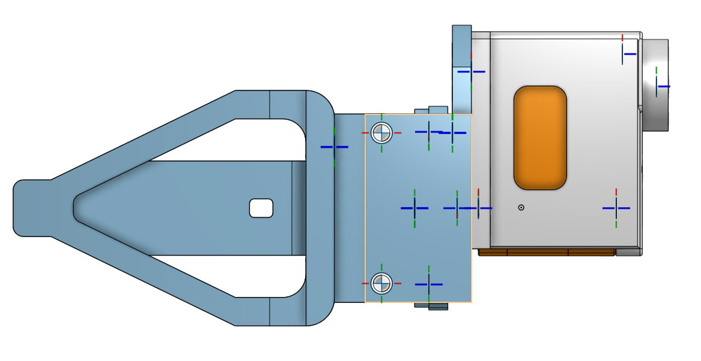
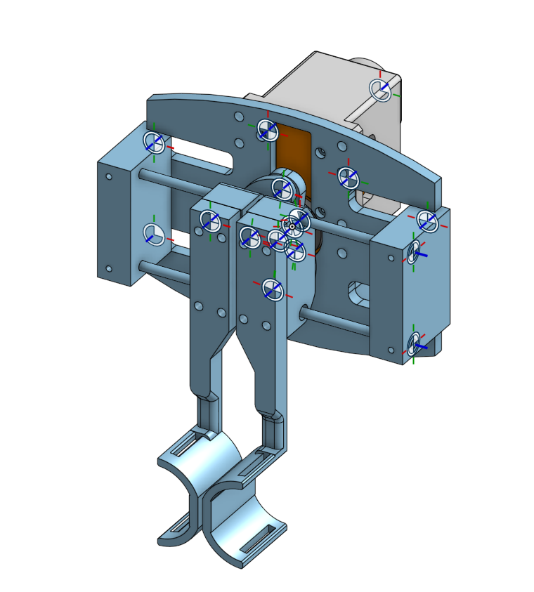
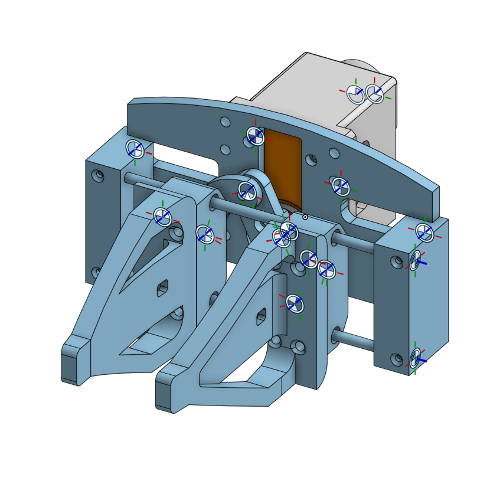
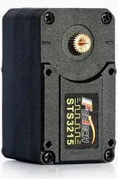
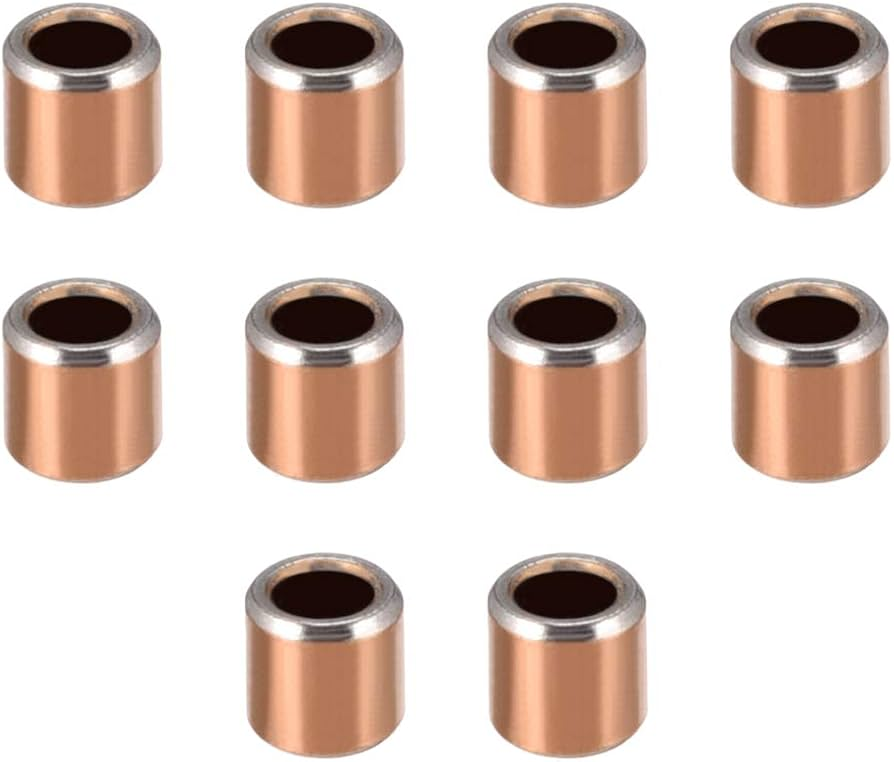
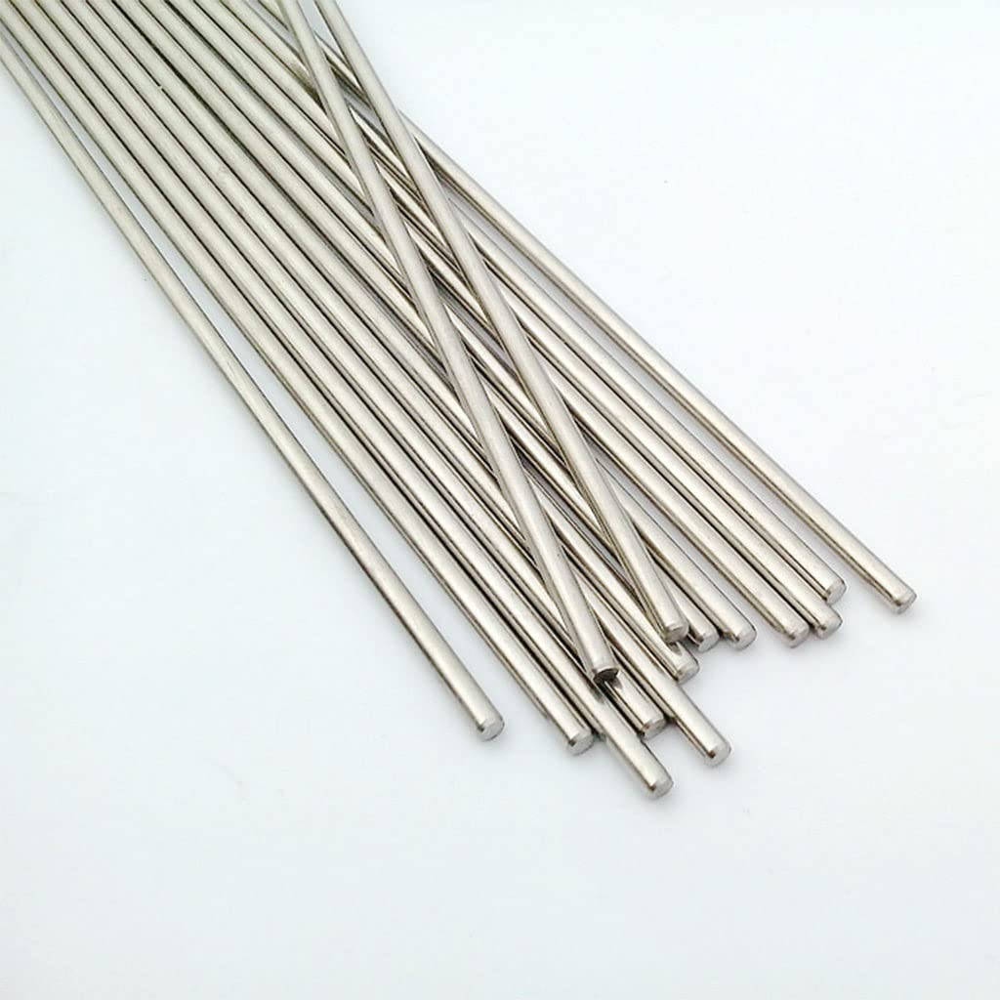

# 🤖 LeRobotHackathon – Gripper Module

## 📘 Overview

This repository contains the design and documentation of a **custom parallel gripper** developed for the LeRobot Hackathon. The gripper is designed for integration with robotic arms such as the SO-100 and is optimized for tasks requiring precision and adaptability.

---

## 🖼️ Visual Renders

### 💡 Assembly Views

  
*Gripper – Left-side view (assembled)*

  
*Gripper – Orthogonal view (assembled)*

  
*Gripper – Orthogonal view (mechanical constraints visible)*

---

## 🛠️ Gripper Description

### 🔧 General Structure

- Composed of **two synchronized jaws** that open and close in parallel.
- Built with **3D printed or machined parts**, designed with triangular geometries to reduce weight and preserve strength.
- Includes a **motor mount** at the rear for housing the actuator (e.g., NEMA motor).

### ⚙️ Motion System

- Incorporates **two horizontal guide rods** (top and bottom) for maintaining parallelism during motion.
- Movement is transmitted through a **linkage system** connecting the jaws to a central mechanism.
- The driving force is likely supplied via a **worm gear, cam, or eccentric rotary system**.

### 🔩 Assembly and Mounting

- CAD design includes **degrees of freedom constraints**, represented with standard DoF symbols (used in Onshape/SolidWorks).
- A **rigid rear plate** ensures proper alignment and solid structural support during operation.

### 📦 Potential Applications

- Handling **small to medium-sized objects** in structured environments.
- Integration with **robotic platforms** such as the SO-100 for education, research, or prototyping.
- Potential use in **medical tasks** (e.g., robotic auscultation) when adapted to hold specialized instruments like stethoscopes.

---

## 🧰 Bill of Materials (BoM)

| Component              | Description                                            | Reference Image                                   |
|------------------------|--------------------------------------------------------|--------------------------------------------------|
| **3D Printing Filament** | PLA or ABS (chosen based on strength and availability) |                                                  |
| **Servo Motor**        | Feetech STS3215                                       |             |
| **Sleeve Bearings**    | Inner Ø 3 mm, Outer Ø 5 mm                             |             |
| **Steel Shafts**       | Diameter: 3 mm                                        |           |
| **Screws**             | M3 metric screws (3 mm diameter)                      |                                                  |

---

## Video

